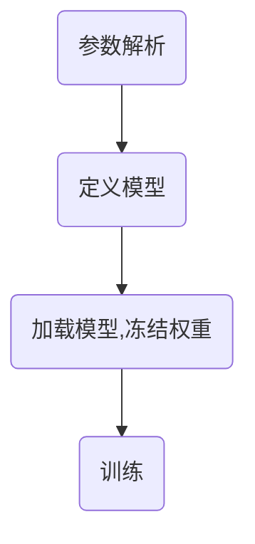

# 本项目为基于条件语言模型的蛋白质可控优化的微调代码

## 1. 文件介绍

+ data_processor.ipynb: 蛋白质序列数据处理
+ fast_transformer.py: 原论文作者代码，仅供参考
+ ProteinDataset.py: 原论文作者代码，为蛋白质数据集的class。
+ finetuning_train.sh: 训练脚本，包含必要的参数信息
+ pytorch_transformer.py: 原论文作者代码，包含模型结构
+ result_analysis.ipynb: 对模型生成序列的质量进行分析
+ training.py: 训练代码
+ transformer_lora.py: 将LoRa加入transformer中。
+ transformProtein_simplified.py: 在transformProtein.py的基础上进行修改，支持微调蛋白质标签的编码转换（溶菌酶蛋白质家族）。
+ transformProtein.py: 原论文作者代码，为蛋白质标签数据的处理，包含两类标签的处理过程。

## 2. 程序执行流程

+ train.py

